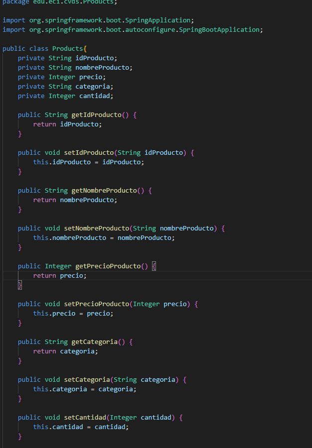
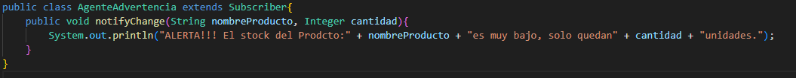
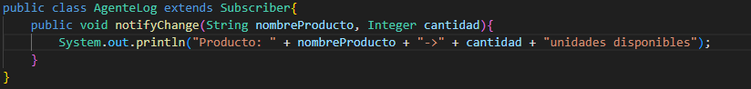
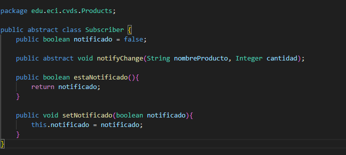
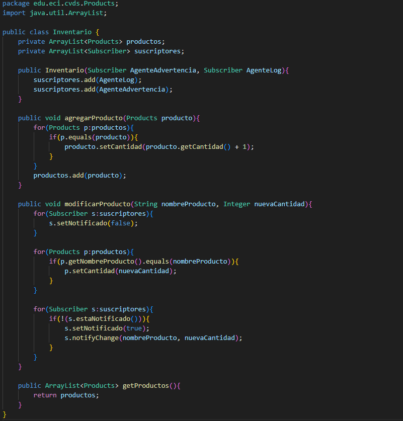
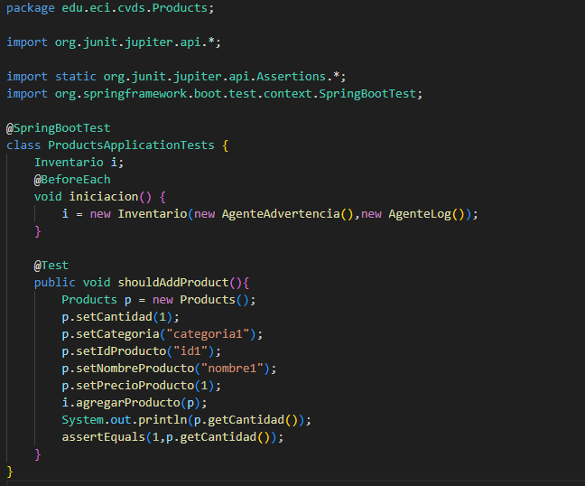
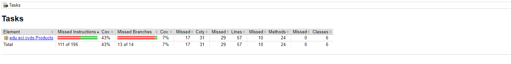

Inicializamos el proyecto con spring initializr

Creamos la clase del producto, la cual va a tener el Id, el nombre, la cantidad, el precio y la categoria

Ya que se debe elegir un patron de diseño, escogeremos Observer, ya que avisa a todos los Subscriber cuando algo cambió, así pueden trabajar los agentes simultaneamente

Para implementarlo, creamos la clase suscriptor y las clases de los agentes que extienden de la clase suscriptor donde se debe hacer un método abstracto para notificar a los agentes de cada cambio

Creamos el inventario con lo especificado, es decir, añadir un producto y modificar el stock, así mismo mediante el patrón de observer, se avisa de los cambios

Hacemos un test para revisar que el codigo haya quedado correcto, hacemos una instancia de inventario antes de cada test para que sea má fácil probar

Usando jacoco vemos que el test que hicimos cubre el 43% del codigo de products
